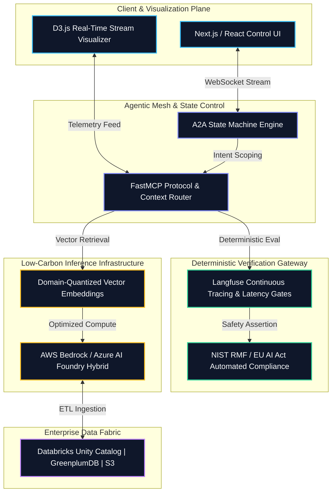
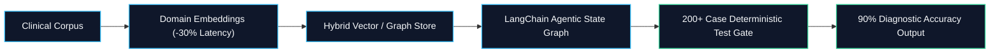
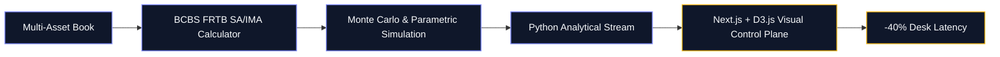
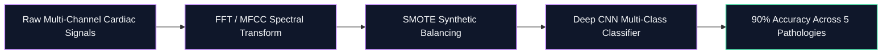

# Nishant Mishra

### AI Systems Architect • Distributed Inference & Orchestration • Client-Embedded Engineering

  
  
  
  

---

## 🛰️ Production AI Topology & Control Plane

---

## 🏛️ Architectural Pillars

<table>
<tr>
<td width="50%" valign="top">

### 1. Agentic Mesh & State Orchestration
 

- **State-Machine Governance**: Architected resilient agent-to-agent (A2A) topologies with deterministic state transitions, replacing fragile ad-hoc chains with verifiable workflows.
- **Enterprise Data Federation**: Deployed unified context-routing layers across disparate data architectures including Salesforce Lightning, AWS S3, GreenplumDB, and Databricks Unity Catalog.
- **Unified Runtime**: Standardized multi-model execution across Azure AI Foundry and Amazon Bedrock.

</td>
<td width="50%" valign="top">

### 2. Deterministic Evaluation & Observability
 

- **Continuous Tracing**: Integrated **Langfuse** tracing, custom assertions, and latency monitors into automated CI/CD verification gates.
- **Automated Regression Benches**: Validated multi-step agent reasoning across 200+ edge-case test fixtures for clinical and quantitative financial systems.
- **Regulatory Frameworks**: Operationalized policy enforcement compliant with **NIST RMF**, **EU AI Act**, and **GDPR** at model runtime and boundary layers.

</td>
</tr>
<tr>
<td width="50%" valign="top">

### 3. Sustainable, Low-Latency Inference
 

- **Quantized Embedding Pipelines**: Engineered domain-specific embedding representations, reducing inference latency by **30%** and significantly trimming active GPU compute footprint.
- **Semantic Caching & Pruning**: Deployed vector similarity caches and token pruning to eliminate redundant inference calls and minimize energy draw.
- **High-Throughput Ingestion**: Architected distributed ETL pipelines for zero-loss real-time data synchronization across cloud boundaries.

</td>
<td width="50%" valign="top">

### 4. Reactive Client-Facing Control Planes
 

- **Quantitative Risk Dashboards**: Built real-time **Next.js & D3.js** calculation platforms for Monte Carlo, Parametric, and Historical VaR simulations, reducing insight generation latency by **~40%**.
- **Human-in-the-Loop Visualizers**: Designed reactive state-machine streaming interfaces for live agent trace telemetry, dynamic graph rendering, and executive steering.
- **Zero-Layout-Shift Systems**: Engineered modular, high-density component libraries in React and Tailwind CSS.

</td>
</tr>
</table>

---

## 🧪 Selected Production Implementations

### 1. MediMind: Deterministic Clinical Decision Architecture

- **Core Capabilities**: Multi-step clinical reasoning engine combining medical ontologies, semantic embeddings, and automated boundary checking.
- **Verification Gate**: Validated against an automated 200+ case regression test bench to guarantee deterministic diagnostic recommendations.

---

### 2. Enterprise Quantitative Market Risk (VaR) Engine

- **Core Capabilities**: High-throughput risk simulation engine automating BCBS FRTB Standardized and Internal Model Approach capital charge computations.
- **Performance**: Interactive D3.js visualizers streamlined sensitivity backtesting, cutting analysis latency by ~40%.

---

### 3. Biosignal Neural Diagnostic Pipeline (Microsoft Learn Societal Impact Finalist)

---

## 🛠️ Systems & Technology Matrix

| Architectural Layer | Core Stack & Technologies |
| :--- | :--- |
| **Agentic Mesh & State Control** | `LangGraph` `LangChain` `LlamaIndex` `FastMCP` `WebSockets` `Python` `TypeScript` |
| **Verification & Observability** | `Langfuse` `NIST RMF` `EU AI Act` `GDPR Compliance` `Automated Assertions` |
| **Inference & Green Infrastructure** | `Amazon Bedrock` `Azure AI Foundry` `AWS S3` `Quantized Embeddings` `Semantic Caching` |
| **Data Fabric & Topologies** | `Databricks Unity Catalog` `Neo4j (Cypher)` `PostgreSQL` `GreenplumDB` `MySQL` |
| **Visualization & Front-End** | `Next.js` `React` `Tailwind CSS` `D3.js` `State-Driven UI` `High-Density Telemetry` |

---

## 🎖️ Technical Honors & Validations

<table>
<tr>
<td width="50%" valign="top">

#### Competitive Benchmarks
- **Top 100 Global Rank** — Amazon ML Challenge 2025
- **Zonal Finalist** — Smart India Hackathon 2024
- **Top 10 Finalist** — Microsoft Learn Societal Impact Initiative

</td>
<td width="50%" valign="top">

#### Technical Specializations & Programs
- **Anthropic**: AI Fluency for Builders
- **NVIDIA**: Fundamentals of Deep Learning
- **McKinsey & Company**: Forward Scholar
- **BCG**: Data Science & Advanced Analytics
- **Yale University**: Financial Markets

</td>
</tr>
</table>

---

  Nishant Mishra • Enterprise AI Systems & Distributed Architecture

